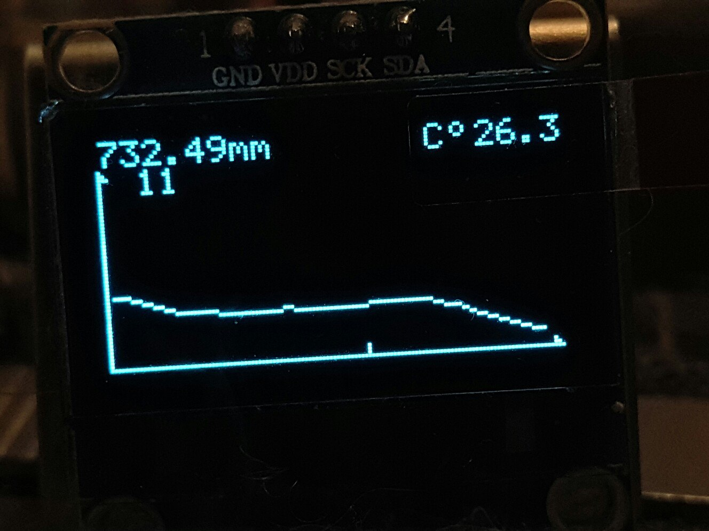

# barometr-arduino

# Возможности:
  - отображение давление
  - отображение температуры
  - отображение графика давления воздуха
  - сохранение данных давления в eeprom
# Что будет
  - меню 
  - выбор и отображении информации о точке на графике
  - влажность воздуха
  - все вышеперечисленное будет сделано на основе прерываний
  - питание от аккумулятора
  - режим энергосбережения
  - сохранение лога на карту памяти
